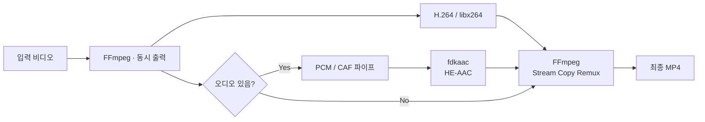

# 127c-encoder


1227 Cloud용 비디오 인코딩 클라이언트

## 주요 기능

* 여러 비디오 파일을 큐에 추가해 순차 인코딩
* 드래그 앤 드롭, 순서 변경, 선택/전체 제거 지원
* 인코딩 중지 및 완료된 작업 건너뛰기 지원
* 출력 폴더 지정
* FFmpeg 자동 설치·검증, fdkaac 동봉
* 오디오 없는 비디오 지원
* 동일한 출력 파일명이 존재하면 자동으로 번호 추가

## 인코딩 설정

| 항목                    | 설정                         |
| --------------------- | -------------------------- |
| 비디오                   | H.264 / `libx264`          |
| 품질                    | CRF 28                     |
| 프로필                   | High@Level 4.0             |
| Tune                  | `animation`                |
| Preset                | `fast` / `medium` / `slow` |
| 기본 오디오                | HE-AAC v1 64k Stereo       |
| 절약 오디오                | HE-AAC v2 32k Stereo       |
| 오디오 게인                | 기본 0 dB                    |
| Dynamic Normalization | 선택 적용                      |

출력 파일명은 기본적으로 다음 형식을 사용

```text
[127c]원본파일명.mp4
```

동일한 파일이 존재할 경우

```text
[127c]원본파일명 (1).mp4
[127c]원본파일명 (2).mp4
```

형태로 자동 변경

## 인코더

FFmpeg는 프로그램에서 다운로드하고, fdkaac는 릴리스에 동봉

시작 시 두 실행 파일을 확인하며, FFmpeg가 없으면 UI에서 다운로드 가능

* FFmpeg 설치 파일 SHA-256 검증
* `libx264` 지원 여부 확인
* 릴리스 패키징 시 fdkaac SHA-256 검증
* Windows / Linux ZIP과 macOS DMG에 해당 아키텍처용 fdkaac 포함 (x64 / ARM64)
* fdkaac가 없거나 실행되지 않으면 오디오 인코딩 전에 앱 재설치 안내
* fdkaac를 사용할 수 없는 환경에서도 오디오가 없는 영상은 FFmpeg만으로 처리 가능

## 실행

macOS 12 이상: 릴리스에서 기기에 맞는 `osx-x64` 또는 `osx-arm64` DMG를 받아 앱을 Applications 폴더로 옮깁니다. macOS 빌드는 .NET 8을 사용하고 앱과 동봉 인코더의 최소 OS 버전을 12로 설정합니다. macOS 12/13은 현재 .NET 공식 테스트 범위 밖이므로 실제 기기에서 실행 확인이 필요합니다. 현재 DMG는 Apple Developer ID 서명·공증을 거치지 않았으므로 최초 실행 시 macOS의 보안 설정에서 앱 열기를 허용해야 할 수 있습니다. 설정과 다운로드된 FFmpeg는 `~/Library/Application Support/127c-encoder`에, 기본 출력은 `~/Movies/127c-encoder`에 저장됩니다.

각 플랫폼 릴리스에는 fdkaac와 fdk-aac의 고지 파일을 함께 넣습니다. FFmpeg는 첫 실행 시 내려받고 SHA-256을 확인합니다.

```bash
dotnet run
```

개발 중 watch 모드

```bash
DOTNET_USE_POLLING_FILE_WATCHER=1 dotnet watch
```

## 코드 구성

* `Ffmpeg/` — FFmpeg 탐색, 다운로드, 설치 및 검증
* `Fdkaac/` — 동봉한 fdkaac 탐색 및 검증
* `Encoding/` — 입력 검증, 인코딩 인자 생성 및 프로세스 실행
* `Settings/` — 프로그램 설정
* `MainWindow` — UI 및 인코딩 작업 관리

## 인코딩 파이프라인

FFmpeg 하나가 H.264 영상과 PCM 오디오를 동시에 출력합니다. PCM은 파이프로 fdkaac에 전달되어 바로 HE-AAC로 인코딩되며, 두 프로세스가 끝나면 최종 MP4로 합칩니다. 오디오가 없는 입력은 영상만 처리합니다.

진행률 바는 FFmpeg 처리 진행률을 표시하고, 인코딩 종료 후에는 마무리 중 표시로 전환됩니다. 최종 MP4 리먹싱까지 성공해야 완료로 처리합니다.


