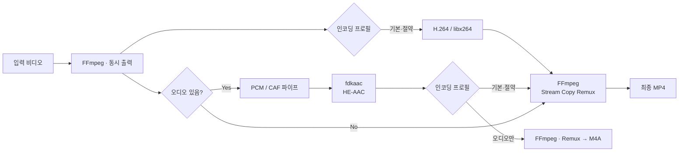

# 127c-encoder


1227 Cloud용 비디오 인코딩 클라이언트

## 주요 기능

* 여러 비디오 파일을 큐에 추가해 순차 인코딩
* 드래그 앤 드롭, 순서 변경, 선택/전체 제거 지원
* 디인터레이싱, 비트레이트 및 버퍼, 오디오 게인 및 노멀라이징 설정 제공
* 비디오별 볼륨 게인값 분석
* 비디오별 저장 위치·인코딩 설정·자르기·오디오 스트림 선택 및 일괄 적용
* 작업 표시줄(또는 Dock)에 현재 파일의 인코딩 진행률 표시
* Windows, Linux, macOS 모두 동일하게 사용 가능

## 인코딩 설정

| 항목                    | 설정                         |
| --------------------- | -------------------------- |
| 비디오                   | H.264 / `libx264`          |
| 품질                    | 기본 CRF 28 / 절약 CRF 29     |
| 프로필                   | High@Level 4.0             |
| Tune                  | `animation`                |
| Preset                | `fast` / `medium` / `slow` |
| 기본 오디오                | HE-AAC v1 64k Stereo       |
| 절약 오디오                | HE-AAC v2 32k Stereo       |
| 오디오 게인                | 기본 0 dB                    |
| Dynamic Normalization | 선택 적용                      |

## 실행

소스 실행에는 .NET 10 SDK가 필요합니다.

```bash
dotnet run
```

## 인코더 다운로드

릴리스 ZIP·DMG에는 앱만 포함됩니다. 첫 실행 안내 또는 '인코더 다운로드'를 통해 FFmpeg와 fdkaac를 내려받고 SHA-256 및 실행 가능 여부를 확인합니다. 설치된 인코더는 다음 실행부터 재사용합니다.

Windows·Linux에서는 앱 폴더의 `encoder` 아래에, macOS에서는 `~/Library/Application Support/127c-encoder/encoder` 아래에 저장합니다. fdkaac의 `FDK-AAC-NOTICE` 고지 파일도 함께 내려받습니다.

## 코드 구성

* `Ffmpeg/` — FFmpeg 탐색, 다운로드, 설치 및 검증
* `Fdkaac/` — fdkaac 다운로드, 설치 및 검증
* `Encoding/` — 입력 검증, 인코딩 인자 생성 및 프로세스 실행
* `Settings/` — 프로그램 설정
* `Tools/` — 게인 분석, 비디오별 설정 및 자르기 다이얼로그
* `Platform/` — 작업 표시줄·Dock 진행률 및 Linux 데스크톱 연동
* `Power/` — 인코딩 중 절전 방지
* `Diagnostics/` — 로그 버퍼 관리
* `Assets/` — 앱 아이콘
* `scripts/` — fdkaac 빌드·패키징 및 macOS 앱 패키징
* `.github/workflows/` — 빌드 및 릴리스 자동화
* `MainWindow` — UI 및 인코딩 작업 관리
* `LogWindow` — 로그 창

## 인코딩 파이프라인


```mermaid
flowchart LR
    A["입력 비디오"] --> X["FFmpeg · 동시 출력"]
    X --> P{"인코딩 프로필"}
    P -->|기본·절약| B["H.264 / libx264"]
    X --> C{"오디오 있음?"}

    C -->|Yes| D["PCM / CAF 파이프"]
    D --> E["fdkaac<br/>HE-AAC"]

    B --> F["FFmpeg<br/>Stream Copy Remux"]
    E --> R{"인코딩 프로필"}
    R -->|기본·절약| F
    R -->|오디오만| H["FFmpeg · Remux → M4A"]
    C -->|No| F

    F --> G["최종 MP4"]
```
