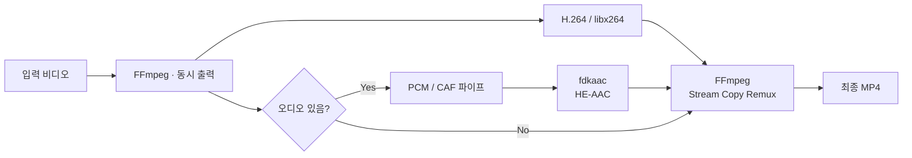

# 127c-encoder


1227 Cloud용 비디오 인코딩 클라이언트

## 주요 기능

* 여러 비디오 파일을 큐에 추가해 순차 인코딩
* 드래그 앤 드롭, 순서 변경, 선택/전체 제거 지원
* 디인터레이싱, 비트레이트 및 버퍼, 오디오 게인 및 노멀라이징 설정 제공
* Windows, Linux, macOS 모두 동일하게 사용 가능

## 인코딩 설정

| 항목                    | 설정                         |
| --------------------- | -------------------------- |
| 비디오                   | H.264 / `libx264`          |
| 품질                    | CRF 28                     |
| 프로필                   | High@Level 4.0             |
| Tune                  | `animation`                |
| Preset                | `fast` / `medium` / `slow` |
| 기본 오디오                | HE-AAC v1 64k Stereo       |
| 절약 오디오                | HE-AAC v2 32k Stereo       |
| 오디오 게인                | 기본 0 dB                    |
| Dynamic Normalization | 선택 적용                      |

## 실행

```bash
dotnet run
```

## 코드 구성

* `Ffmpeg/` — FFmpeg 탐색, 다운로드, 설치 및 검증
* `Fdkaac/` — 동봉한 fdkaac 탐색 및 검증
* `Encoding/` — 입력 검증, 인코딩 인자 생성 및 프로세스 실행
* `Settings/` — 프로그램 설정
* `MainWindow` — UI 및 인코딩 작업 관리

## 인코딩 파이프라인


```mermaid
flowchart LR
    A["입력 비디오"] --> X["FFmpeg · 동시 출력"]
    X --> B["H.264 / libx264"]
    X --> C{"오디오 있음?"}

    C -->|Yes| D["PCM / CAF 파이프"]
    D --> E["fdkaac<br/>HE-AAC"]

    B --> F["FFmpeg<br/>Stream Copy Remux"]
    E --> F
    C -->|No| F

    F --> G["최종 MP4"]
```
