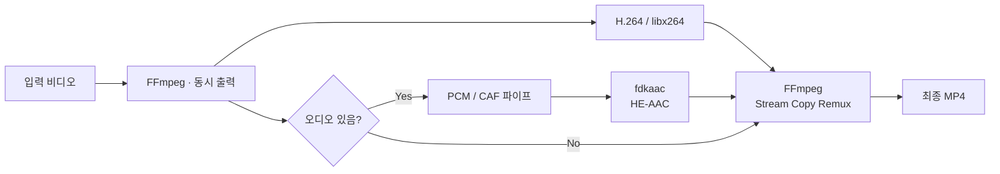

# 127c-encoder


1227 Cloud용 비디오 인코딩 클라이언트

## 주요 기능

* 여러 비디오 파일을 큐에 추가해 순차 인코딩
* 드래그 앤 드롭, 순서 변경, 선택/전체 제거 지원
* 디인터레이싱, 비트레이트 및 버퍼, 오디오 게인 및 노멀라이징 설정 제공
* 비디오 우클릭 메뉴에서 고정 게인 분석
* Windows, Linux, macOS 모두 동일하게 사용 가능

## 인코딩 설정

| 항목                    | 설정                         |
| --------------------- | -------------------------- |
| 비디오                   | H.264 / `libx264`          |
| 품질                    | CRF 28                     |
| 프로필                   | High@Level 4.0             |
| Tune                  | `animation`                |
| Preset                | `fast` / `medium` / `slow` |
| 기본 오디오                | HE-AAC v1 64k Stereo       |
| 절약 오디오                | HE-AAC v2 32k Stereo       |
| 오디오 게인                | 기본 0 dB                    |
| Dynamic Normalization | 선택 적용                      |

## 게인 분석

큐의 비디오를 우클릭한 뒤 **게인 분석…**을 선택하세요. 해당 비디오를 측정하고 **게인 적용**을 누르면 메인 화면의 게인 숫자를 변경합니다. 노멀라이징이 체크되어 있으면 해제 여부를 묻습니다. **예**는 노멀라이징을 해제하고, **아니오**는 체크를 유지한 채 게인을 적용합니다. 게인은 큐 전체에 사용하는 공통 설정입니다.

게인 분석 조건은 적용하지 않고 창을 닫아도 유지되며, 앱 종료 시 `settings.json`에 저장해 다음 실행에서 복원합니다.

첫 번째 오디오 트랙을 FFmpeg 기본 스테레오 다운믹스·48 kHz float로 변환해 구간별 sample peak와 RMS를 측정합니다. 기본값은 1초 구간, 무음 기준 -50 dBFS, 큰 피크 상위 5% 제외, 목표 피크 0 dBFS, 증폭 상한 20 dB입니다. 남은 최대 피크로 게인을 계산하고 1 dB 단위로 내립니다. 상세 조건에서 분석 시작·길이와 측정 조건을 조정할 수 있으며, 분석 중 취소하거나 창을 닫으면 FFmpeg도 종료합니다. Python은 필요하지 않습니다.

측정과 실제 인코딩은 같은 다운믹스·샘플레이트 조건을 사용합니다. 큰 피크 제외는 효과음·대사를 분류하지 않으며, True peak나 LUFS 측정도 아닙니다. 결과의 클리핑 예상 비율은 **구간 수 비율**이고 샘플 비율이나 지속시간이 아닙니다. 큰 피크를 제외하면 출력에서 클리핑이 발생할 수 있습니다. 제외 비율을 0%로 설정하면 전체 활성 구간의 최대 피크를 기준으로 계산합니다. 분석 범위를 지정한 결과도 트랙 전체에 고정 게인으로 적용됩니다.

## 실행

```bash
dotnet run
```

## 인코더 다운로드

릴리스 ZIP에는 앱 실행 파일만 포함됩니다. 처음 실행한 뒤 '인코더 다운로드'를 누르면 FFmpeg와 fdkaac를 내려받고 SHA-256 및 실행 가능 여부를 확인합니다. 설치된 인코더는 다음 실행부터 재사용합니다.

Windows·Linux에서는 앱 폴더의 `encoder` 아래에, macOS에서는 `~/Library/Application Support/127c-encoder/encoder` 아래에 저장합니다. fdkaac의 `FDK-AAC-NOTICE` 고지 파일도 함께 내려받습니다.

## 코드 구성

* `Ffmpeg/` — FFmpeg 탐색, 다운로드, 설치 및 검증
* `Fdkaac/` — fdkaac 다운로드, 설치 및 검증
* `Encoding/` — 입력 검증, 인코딩 인자 생성 및 프로세스 실행
* `Settings/` — 프로그램 설정
* `Tools/` — 게인 분석 다이얼로그
* `MainWindow` — UI 및 인코딩 작업 관리

## 인코딩 파이프라인


```mermaid
flowchart LR
    A["입력 비디오"] --> X["FFmpeg · 동시 출력"]
    X --> B["H.264 / libx264"]
    X --> C{"오디오 있음?"}

    C -->|Yes| D["PCM / CAF 파이프"]
    D --> E["fdkaac<br/>HE-AAC"]

    B --> F["FFmpeg<br/>Stream Copy Remux"]
    E --> F
    C -->|No| F

    F --> G["최종 MP4"]
```
